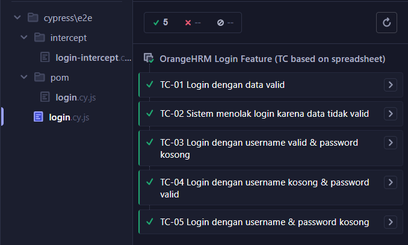
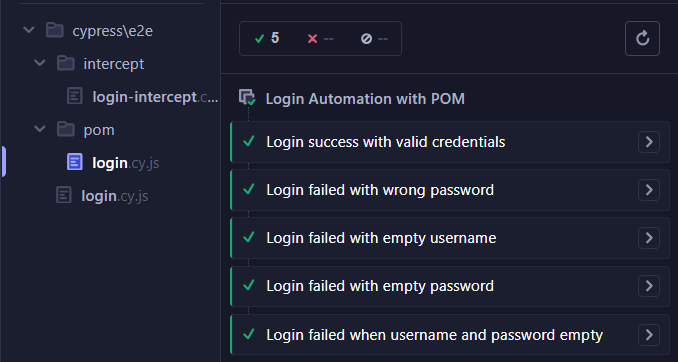

# OrangeHRM Login Automation - Cypress

## Feature
Login automation for OrangeHRM
Automation ini mencakup:
- Login scenario normal & negative
- Penggunaan Cypress Intercept untuk simulasi response backend
- Penggunaan Page Object Model (POM)

  

## Test Cases
TC-01 Valid Login  
TC-02 Invalid Login  
TC-03 Username valid & password empty  
TC-04 Username empty & password valid  
TC-05 Both fields empty

  

## Test Cases - Intercept
1. Login Success  
2. Login Failed - Wrong password
3. Login Failed - Empty username
4. Login Failed - Server error
5. Login with delayed response

  

## Test Cases - POM
1. Login Success  
2. Login Failed - Wrong Password
3. Login Failed - Empty Username
4. Login failed - Empty password
5. Login failed - Both fields empty

